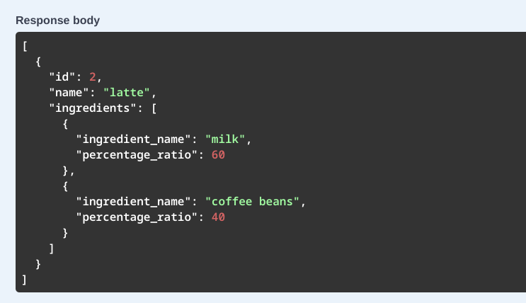
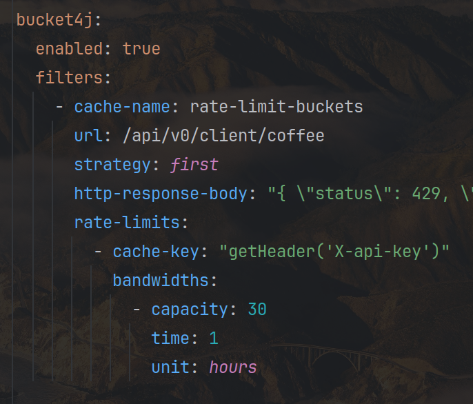

# API для управления кофемашиной

# Функционал программы:

## Клиентский АПИ
- Готовка кофе
- Получение рейтинга напитков
- Получение меню напитков c описанием их ингредиентов:

  

## Админский АПИ
- Занесение новых ингредиентов
- Занесение новых напитков и их рецептуры:

  

- Удаление напитков по идентификаторам
- Удаление ингредиентов по идентификаторам
- Пополнение емкостей с ингридиентами

_________

# Основная схема АПИ в Swagger:

_________

# Особенности программы:

### 1. АПИ системы вынесено в Swagger.
Каждая конечная точка в Swagger UI содержит описание функционала, а также примеры принимаемых и возвращаемых значений:

### 2. Гибкая логика.
Написанное АПИ универсально. В него можно добавлять по отдельности ингредиенты и связанные с ними напитки с рецептами.
Также у каждого ингредиента имеется емкость бака, которая уменьшается в зависимости от выбранного объема напитка.

### 3. Наличие системы логирования и миграций базы данных.
- В программу была включена система логирования на основе Logback. В ходе работы программы данные автоматически пишутся
  в файлы:

- Для миграций базы данных использовался FlyWay. Написанный скрипт хранит базовую версию таблиц приложения.

### 5. Наличие системы очистки статистики.
Программа может сохранять данные о ретинге имеющихся напитков:

Сохраненные значения должны очищаться каждые 5 лет. Для решения данной задачи используется планировщик Spring - @Scheduler:

### 5. Наличие ограничений доступа к АПИ.
Кофемашина может готовить только 30 чашек кофе в час :( Для создания данного ограничения использовался Bucket4j:

Результат превышения нормы:

